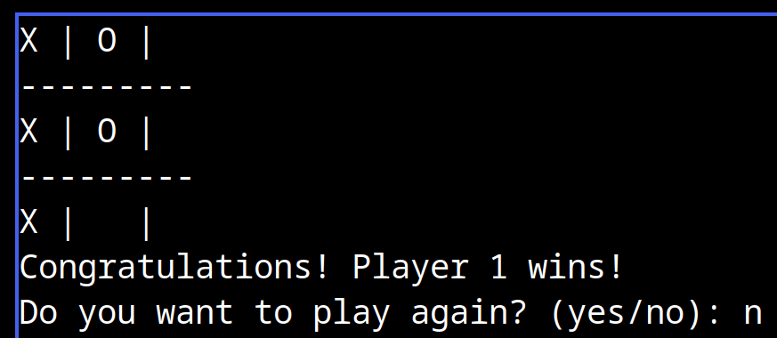

#giggle_grid.py

Tic-Tac-Toe, also known as Noughts and Crosses, is a two-player game where each player takes turns marking a cell in a 3×3 grid.

The goal is to be the first to form a horizontal, vertical, or diagonal line of three of your symbols (either “X” or “O”) on the grid. If all cells are filled without a winner, the game ends in a draw.

## Features

- Players can choose their marker ('X' or 'O') at the beginning of each game
- Player 2 automatically takes the opposite marker of Player 1
- The game prompts players to play again after each round

## Installation

1. Clone the repository in the desired directory with the following command:

```bash
git clone https://github.com/scriubuguri/giggle_grid.git
```

2. Make the file `giggle_grid.py` executable:

```bash
chmod +x giggle_grid.py
```

## Usage

Run the following command to start the game:

```bash
./giggle_grid.py
```

and play the game with your friends!

## Example

1. Run the file `giggle_grid.py` in the terminal.
2. Player 1 will be prompted to choose their marker ('X' or 'O').
3. The game board is displayed, and players take turns making moves by entering a number between 0 and 8 corresponding to the grid position.
4. The game continues until a player wins or the board is filled.
5. After each game, players are prompted to play again. If they choose to continue, a new game starts with the players swapping markers.



## Author

- **scriubuguri**


